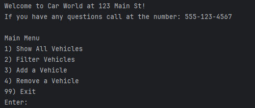
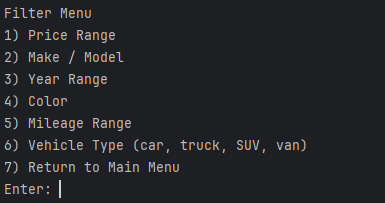
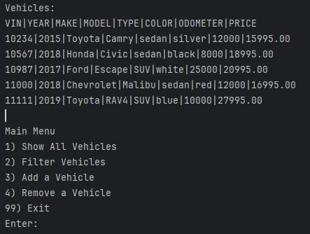
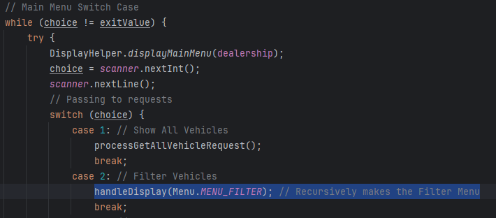
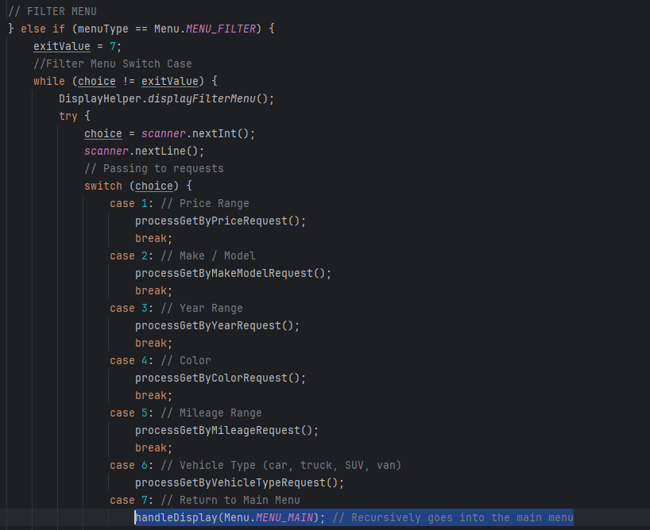

# Car Dealership

## Description of the Project

The Car Dealership program allows a user to manage a Car Dealership. Major objects of the dealership includes:
- Dealerships
- Vehicles

Vehicle information is stored within the dealership.csv file with the attributes:
- VIN
- Year
- Make
- Model
- Vehicle Type
- Color
- Odometer
- Price

Whenever a vehicle is added or removed, the information is updated within the dealership.csv file.

## User Stories
> - As a user I need to see the details of a vehicle, so I can see which vehicle I'd like to purchase.
> - As a user I need to be able to filter vehicles by price, so that I can buy the right vehicle for my budget.
> - As a user I need to be able to search by the make model, so that I can buy the right brand I trust.
> - As a user I need to be able to filter by a vehicle's year, so that I can know how old the vehicle is.
> - As a user I need to be able to see the color of cars available at the dealership, so that I can choose a color that aesthetically pleases me.
> - As a user I need to be able to see a vehicles mileage, so that I can judge how often the car has been used, and if that would depreciate the value of the car.
> - As a user I should be able to see the vehicles by their type, so that I can buy the right vehicle for my needs and/or family.
> - As a user I should be able to see all the vehicles available at the dealership, so that I can compare my needs against what's available.
> - As a dealership owner, I should be able to add new vehicles to the dealership program, so that users can see new vehicles are available.
> - As a dealership owner, I should be able to remove vehicles from the dealership program, so that users can see an accurate inventory.
> - As a user I should be able to see dealership information, so that I can contact the dealership to plan a purchase or visit.
> - As a dealership owner, I should be able to update the dealership with the correct added and removed vehicles, so that I can display an accurate inventory.

## Setup

Instructions on how to set up and run the project using IntelliJ IDEA.

### Prerequisites

- IntelliJ IDEA: Ensure you have IntelliJ IDEA installed, which you can download from [here](https://www.jetbrains.com/idea/download/).
- Java SDK: Make sure Java SDK is installed and configured in IntelliJ.

### Running the Application in IntelliJ

Follow these steps to get your application running within IntelliJ IDEA:

1. Open IntelliJ IDEA.
2. Select "Open" and navigate to the directory where you cloned or downloaded the project.
3. After the project opens, wait for IntelliJ to index the files and set up the project.
4. Find the `program` class with the `public static void main(String[] args)` method.
5. Right-click on the file and select 'Run 'YourMainClassName.main()'' to start the application.

### Using a pre-made .csv file

In order to use a pre-made .csv file with transactions, the file must be named "dealership.csv" placed in the data folder,
and the information needs to follow the format:
> vin|year|make|model|vehicleType|color|odometer|price

## Technologies Used

- IntelliJ IDEA 2023.3.3 (Ultimate Edition)
- Java 17 (Amazon Corretto 17.0.12)

## Demo
### The Main Menu

### The Filter Menu

### Show All Vehicles

## Unique Feature: Menu Recursion
In order to create the separate menus I employed the use of Enums and recursion.

### Main Menu:

### Filter Menu:

## Future Work

- Work on recursion in the menu switch to prevent stack overflow
- Combine methods that repeat similar processes

## Resources

- [Java Recursion](https://www.w3schools.com/java/java_recursion.asp)
- [Java Enums](https://www.w3schools.com/java/java_enums.asp)

## Thanks

Thank you to Raymond Maroun for continuous support and guidance.